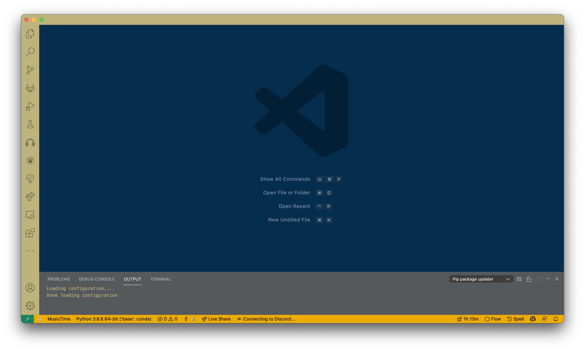
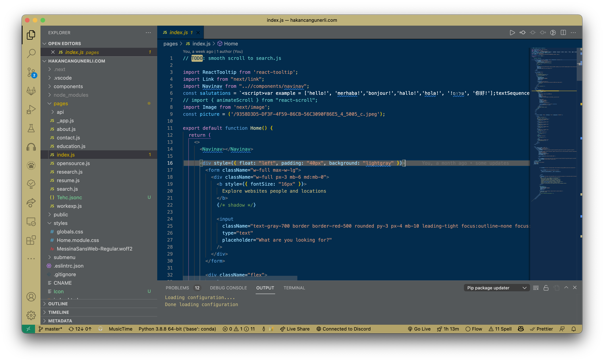

# tehc-theme (will regularly be updated)
tech , but a theme! 🐝

getting into gatech was something i've spent over 5 years of my life on, and i've finally done it. so, before i actually begin, i felt like giving back to the community a little! 

i've never written any vscode extensions before, so if you run into bugs please put it onto issues [here.](https://github.com/hakancangunerli/tehc-theme/issues) 

# Screenshots 

